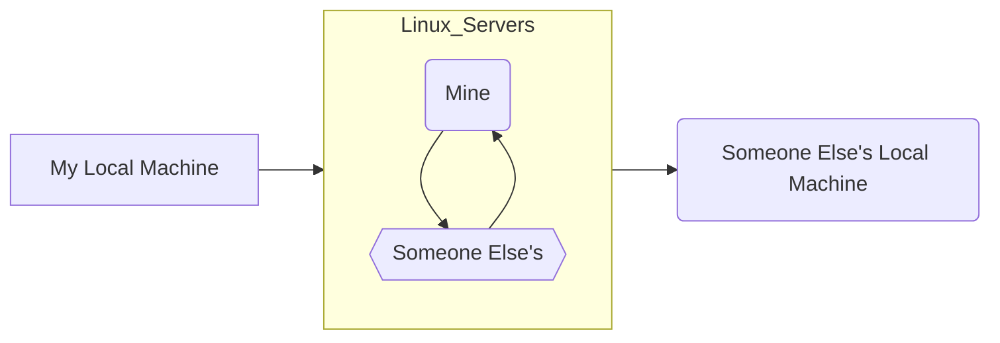

# scp

### SCP is an acronym for Secure Copy Protocol. It is a command that allows the user to securely copy files and directories between two locations usually between linux systems.

### We are able to use SCP in the following cases:

- #### Copy files from a local host to remote host and vice versa.
- #### Copy files between two different remote hosts on the same server.



> [!IMPORTANT]
> To upload to a Remote Server you must NOT be SIGNED INTO the Server rather use a terminal locally and run these commands.

<h2>
1. Copy File From Local Machine to Remote Server
</h2>
Usage Syntax

```bash
scp LocalFileLocation remote_username@IPAddress:FilePath
```
For Example

```bash
scp README.md u20220068@10.1.4.18:/new_dir
```

<h2>
2. Copy File From Remote Server to Local Machine 
</h2>
Usage Syntax

```bash
scp remote_username@IPAddress:FilePath LocalFileLocation
```
For Example

```bash
scp u20220068@10.1.4.18:/lab10.c C:\Users\ABC\Desktop
```

<h2>
3. Copy File From One Remote Server to Another
</h2>
Usage Syntax

```bash
scp remote_username_1@IPAddress:FilePath remote_username_2@IPAddress:FilePath
```
For Example

```bash
scp u20220068@10.1.4.18:/lab10.c u20220085@10.1.4.18:/sem1/.
```
> [!TIP]
> Let's say you want to copy all the files of a directory from Source to Destination then use the following syntax
> ```bash
> scp -r remote_username_1@IPAddress:Dir_Path remote_username_2@IPAddress:Dir_Path
> ```
> The scp -r command in Linux is used to copy an entire directory and its contents.
> This command recursively copies all files and subdirectories from the source directory to the specified destination.